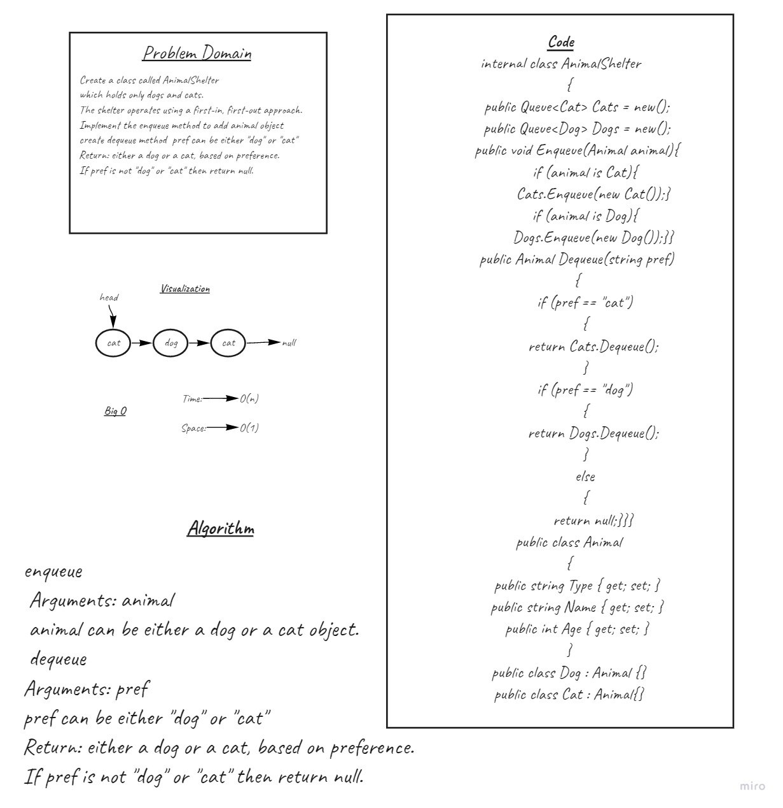

# AnimalShelter

The challenge is to make a new `Class` of `AnimalShelter` which only holds cats and dogs.  

Create an `enqueue` method that adds a new pet to the shelter

Create a `dequeue` method that returns a pet based on a passed in animal preference as an argument. 

## Whiteboard



## Approach & Efficiency


## Solutions


``` C#
 internal class AnimalShelter
    {
        public Queue<Cat> Cats = new();
        public Queue<Dog> Dogs = new();

        // enqueue
        // Arguments: animal
        // animal can be either a dog or a cat object.
        public void Enqueue(Animal animal)
        {
            if (animal is Cat)
            {
                Cats.Enqueue(new Cat());
            }
            if (animal is Dog)
            {
                Dogs.Enqueue(new Dog());
            }
        }

        //dequeue
        //Arguments: pref
        //pref can be either "dog" or "cat"
        //Return: either a dog or a cat, based on preference.
        //If pref is not "dog" or "cat" then return null.
        public Animal Dequeue(string pref)
        {
            if (pref == "cat")
            {
                return Cats.Dequeue();
            }
            if (pref == "dog")
            {
                return Dogs.Dequeue();
            }
            else
            {
                return null;
            }
        }
    }

    public class Animal
    {
        public string Type { get; set; }
        public string Name { get; set; }
        public int Age { get; set; }
    }

    public class Dog : Animal {}

    public class Cat : Animal {}
```