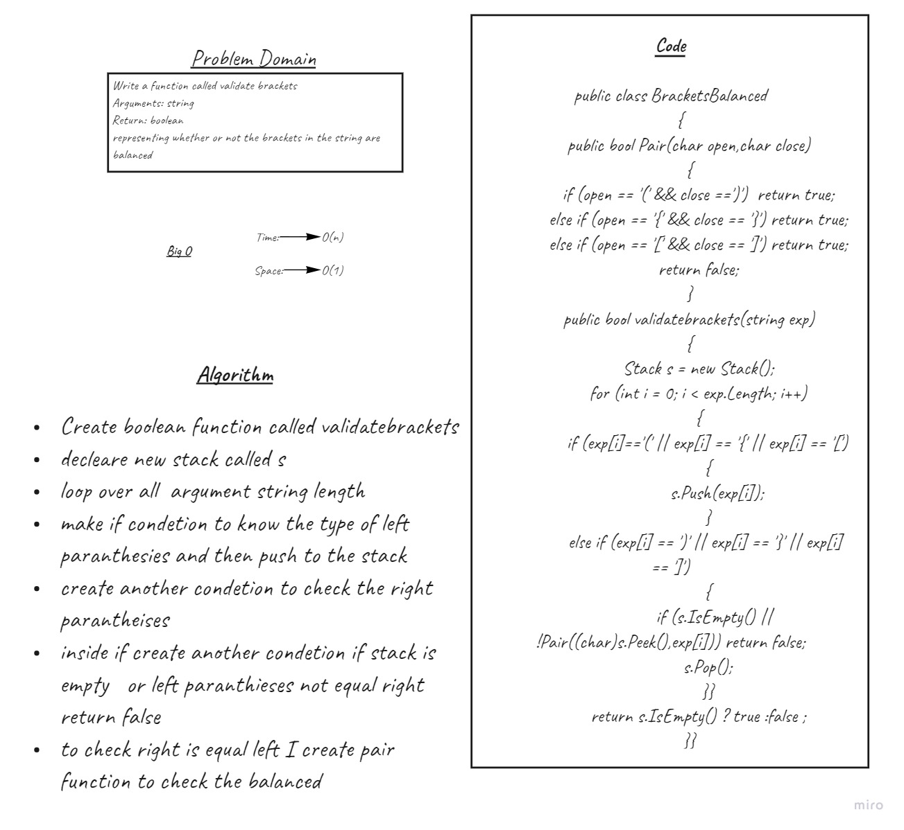
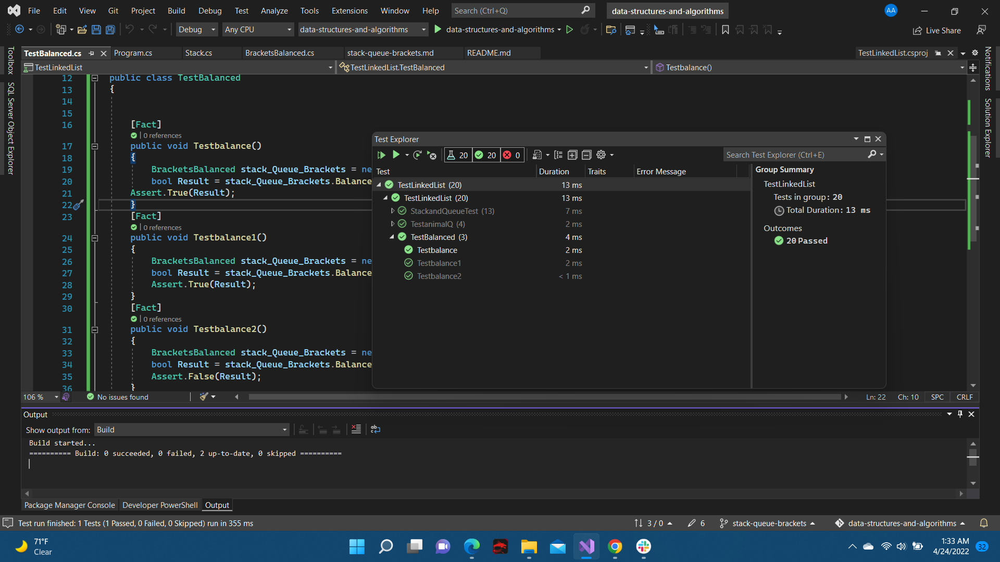

# Challenge Summary
a function representing whether
or not the brackets in the string are balanced

## Whiteboard Process


## Solution
```c#
public class BracketsBalanced
    {
        public bool Pair(char open,char close)
        {
            if (open == '(' && close ==')')  return true; 
            else if (open == '{' && close == '}') return true;
            else if (open == '[' && close == ']') return true;
            return false;
        }
        public bool validatebrackets(string exp)
        {
            Stack s = new Stack();
            for (int i = 0; i < exp.Length; i++)
            {
                if (exp[i]=='(' || exp[i] == '{' || exp[i] == '[')
                {
                    s.Push(exp[i]);
                }
               else if (exp[i] == ')' || exp[i] == '}' || exp[i] == ']')
                {
                   if (s.IsEmpty() || !Pair((char)s.Peek(),exp[i])) return false;
                s.Pop();
                }
            }
           
            return s.IsEmpty() ? true :false ;
        }
    }
```

## Test
