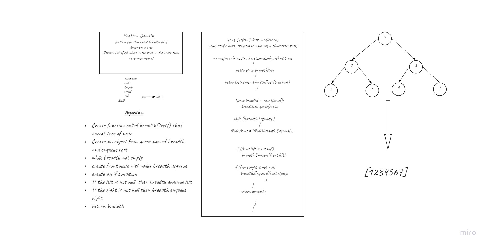

## Challenge Summary
Breadth-first Traversal.

Breadth first traversal iterates through the tree by going through each level of the tree node-by-node.

### Whiteboard

### Approach & Efficiency
 Time O(h)

### API
Write a function called breadth first
Arguments: tree
Return: list of all values in the tree, in the order they were encountered