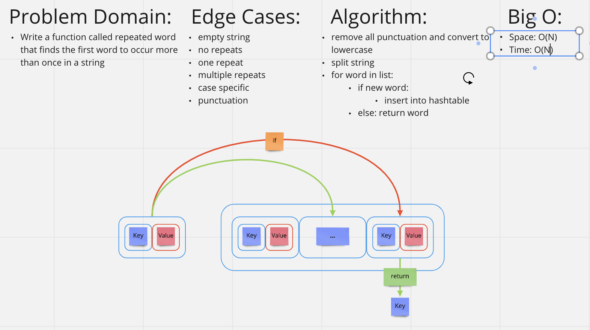

# Challenge Summary
<!-- Description of the challenge -->
Write a function called repeated word that finds the first word to occur more than once in a string

Arguments: string
Return: string
## Whiteboard Process

## Approach & Efficiency
<!-- What approach did you take? Why? What is the Big O space/time for this approach? -->
This algorithms approach is to split the the string into a list and create a dictionary from each word. It then iterates through that original list incrementing each dictionary key as it is found. If any dictionary keys value reaches two it returns that key.- Time: O(N)
- Space: O(N)
## Solution
<!-- Show how to run your code, and examples of it in action -->
```C#
  public class hashmap_repeated_word 
    {
        public static string Repeated(string word)
        {
            word = word.ToLower();
            string[] arrWords = word.Split(' ');
            int count = 0;

            for (int i = 0; i < arrWords.Length; i++)
            {
                for (int j = 0; j < arrWords.Length; j++)
                {
                    if (arrWords[i] == arrWords[j])
                    {
                        count++;
                    }
                }
                if (count > 1)
                {
                    return arrWords[i];
                }
                count = 0;
            }

            return "No repetition";
        }
}
```