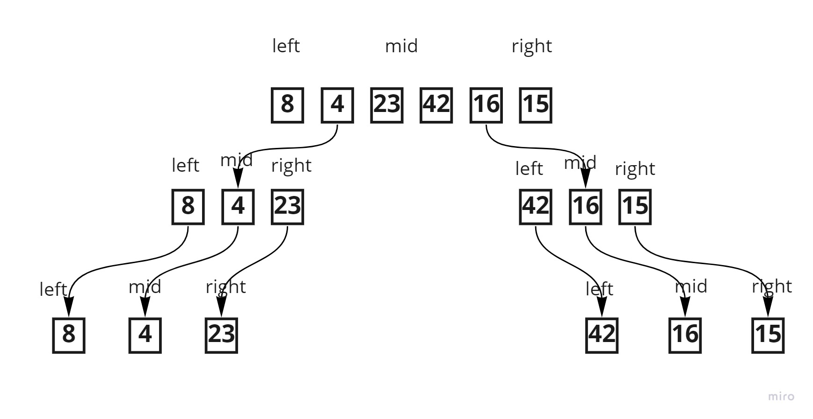

# Challenge Summary
Merge sort is one of the most efficient sorting algorithms. It works on the principle of Divide and Conquer. Merge sort repeatedly breaks down a list into several sublists until each sublist consists of a single element and merging those sublists in a manner that results into a sorted list.




## Solution
```C#
using System;

namespace MergeSort
{
    public class Mergesort
    {
        public static int[] mergeSort(int[] array)
        {
            int[] left;
            int[] right;
            int[] result = new int[array.Length];
            if (array.Length <= 1)
                return array;

            int midPoint = array.Length / 2;
            left = new int[midPoint];

            if (array.Length % 2 == 0)
                right = new int[midPoint];
            else
                right = new int[midPoint + 1];

            for (int i = 0; i < midPoint; i++)
                left[i] = array[i];

            int x = 0;
            for (int i = midPoint; i < array.Length; i++)
            {
                right[x] = array[i];
                x++;
            }
            //Recursively sort the left array
            left = mergeSort(left);
            //Recursively sort the right array
            right = mergeSort(right);
            //Merge our two sorted arrays
            result = merge(left, right);
            return result;
        }

        public static int[] merge(int[] left, int[] right)
        {
            int resultLength = right.Length + left.Length;
            int[] result = new int[resultLength];

            int indexLeft = 0, indexRight = 0, indexResult = 0;

            while (indexLeft < left.Length || indexRight < right.Length)
            {
                if (indexLeft < left.Length && indexRight < right.Length)
                {
                    if (left[indexLeft] <= right[indexRight])
                    {
                        result[indexResult] = left[indexLeft];
                        indexLeft++;
                        indexResult++;
                    }
                    else
                    {
                        result[indexResult] = right[indexRight];
                        indexRight++;
                        indexResult++;
                    }
                }
                else if (indexLeft < left.Length)
                {
                    result[indexResult] = left[indexLeft];
                    indexLeft++;
                    indexResult++;
                }
                else if (indexRight < right.Length)
                {
                    result[indexResult] = right[indexRight];
                    indexRight++;
                    indexResult++;
                }
            }
            return result;
        }
       
        public static void print(int[] array)
        {
            
            foreach (var item in mergeSort(array))
            {
                Console.WriteLine(item);
            }
        }
    }
}
```
