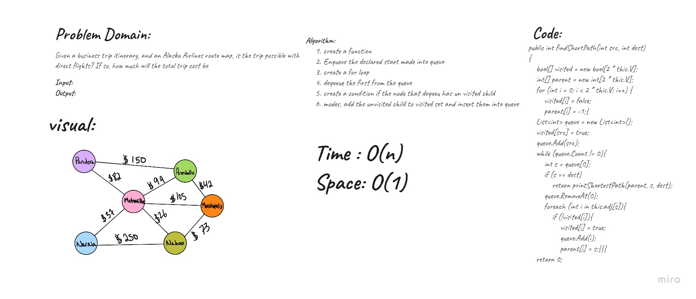

# Challenge Summary
Determine whether the trip is possible with direct flights, and how much it would cost.
## Whiteboard Process



### Complexity
> Big O represents the complexity of a function that increases linearly and in direct proportion to the number of inputs.
- Time: O(n)
- Space: O(1)
### Code:
```C#
using System;
using System.Collections.Generic;
using System.Linq;
using System.Text;
using System.Threading.Tasks;

namespace data_structures_and_algorithms.graph.graphbusinesstrip
{
    class graphbusinesstrip
    {
        public int V;
        public List<int>[] adj;

        static int level;

        public graphbusinesstrip(int V)
        {
            this.V = V;
            this.adj = new List<int>[2 * V];

            for (int i = 0; i < 2 * V; i++)
                this.adj[i] = new List<int>();
        }

        public int printShortestPath(int[] parent, int s, int d)
        {
            level = 0;
            if (parent[s] == -1)
            {
                Console.Write("Shortest Path between" +
                                "{0} and {1} is {2} ", s, d, s);
                return level;
            }

            printShortestPath(parent, parent[s], d);

            level++;
            if (s < this.V)
                Console.Write("{0} ", s);

            return level;
        }
        public int findShortestPath(int src, int dest)
        {
            bool[] visited = new bool[2 * this.V];
            int[] parent = new int[2 * this.V];

            for (int i = 0; i < 2 * this.V; i++)
            {
                visited[i] = false;
                parent[i] = -1;
            }

            List<int> queue = new List<int>();

            visited[src] = true;
            queue.Add(src);

            while (queue.Count != 0)
            {
                int s = queue[0];

                if (s == dest)
                    return printShortestPath(parent, s, dest);
                queue.RemoveAt(0);

                foreach (int i in this.adj[s])
                {
                    if (!visited[i])
                    {
                        visited[i] = true;
                        queue.Add(i);
                        parent[i] = s;
                    }
                }
            }
            return 0;
        }
    }
}

``` 
