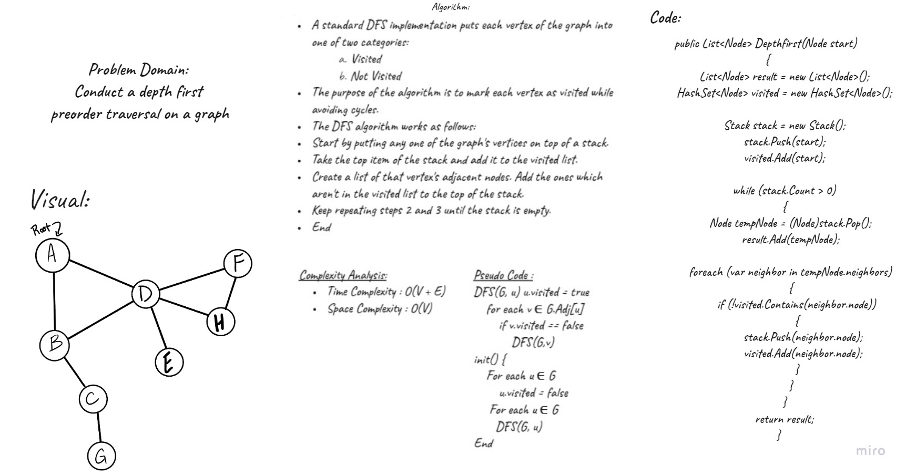

# Depth First Traversal

Depth First Search (DFS) algorithm traverses a graph in a depthward motion and uses a stack to remember to get the next vertex to start a search, when a dead end occurs in any iteration.

# Challenge 

Conduct a depth first preorder traversal on a graph

# Solution

