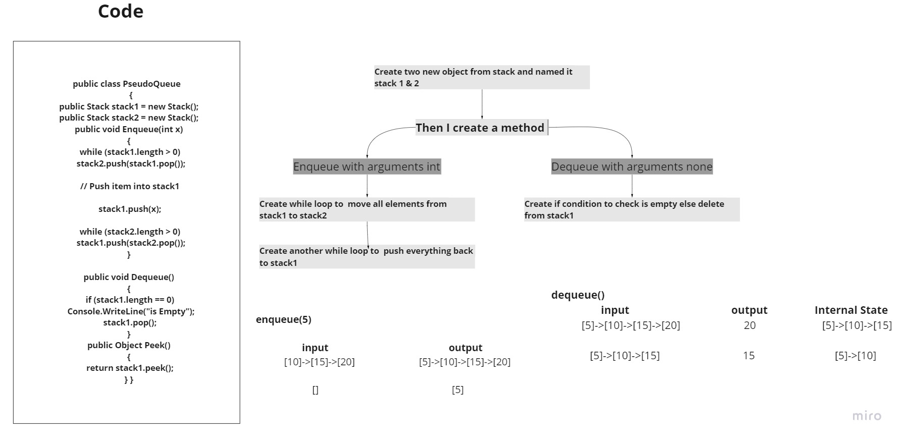

# stack-queue-pseudo

## Whiteboard Process

## Approach & Efficiency
Big O Complexity

1- Enqueue -> O(n)

2- Dequeue -> O(1)

## Test 

### API
#### Enqueue

Arguments: value

Inserts value into the PseudoQueue, using a first-in, first-out approach.

#### Dequeue

Arguments: none

Extracts a value from the PseudoQueue, using a first-in, first-out approach.

NOTE: The Stack instances have only push, pop, and peek methods. You should use your own Stack implementation. Instantiate these Stack objects in your PseudoQueue constructor.
